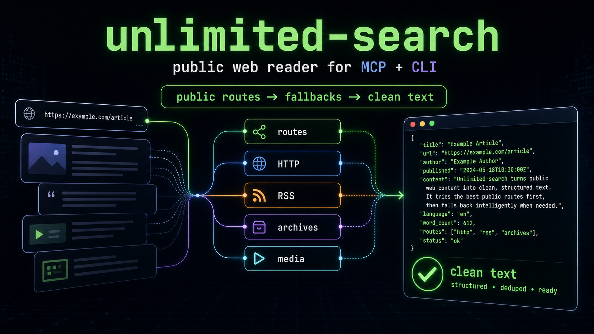
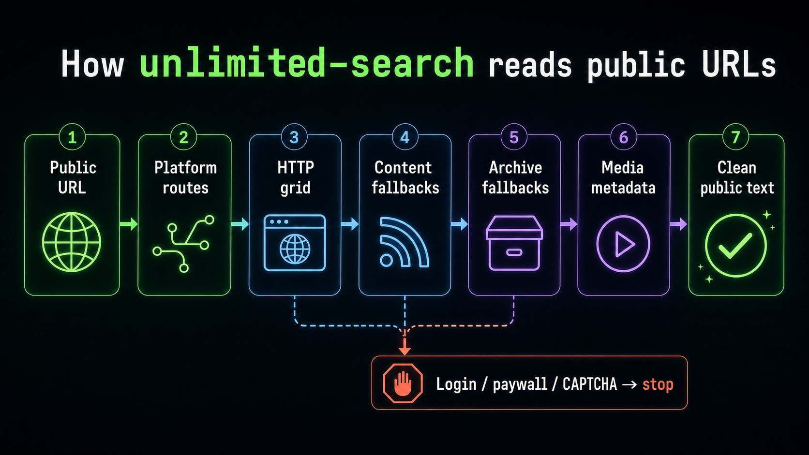

# unlimited-search

[English](README.md) | 한국어 | [中文](README.zh.md) | [日本語](README.ja.md) | [Español](README.es.md)

[](https://github.com/flyingsquirrel0419/unlimited-search/actions/workflows/test.yml)
[](LICENSE)
[](pyproject.toml)

<p align="center"><strong>공개 페이지를 쓸 수 있는 신호로 바꿉니다.</strong></p>

<p align="center">
  
</p>

`unlimited-search`는 일반 direct fetch만으로 부족한 공개 웹 콘텐츠를 읽기 위한 Python CLI 및 MCP 서버입니다. 플랫폼별 공개 route, 브라우저형 HTTP identity, content fallback, 공개 archive fallback, 미디어 메타데이터 추출을 하나의 로컬 도구로 제공합니다.

에이전트와 자동화 환경에서 공개 URL의 사용 가능한 텍스트가 필요할 때 사용하도록 설계되었습니다. 로그인, paywall, CAPTCHA, 사설 네트워크, 계정 제한, IP ban, 접근 제어를 우회하기 위한 도구가 아닙니다.

## 빠른 시작

필수 조건: Python 3.12 이상.

```bash
python -m pip install unlimited-search
unlimited-search read https://en.wikipedia.org/wiki/OpenAI --max-content-chars 800
```

명령은 페이지 `content`, `verdict`, 요청 `metadata`, 시도 `trace`를 담은 JSON을 반환합니다.

MCP 클라이언트에서는 패키지를 설치한 뒤 stdio 서버를 등록합니다.

```json
{
  "mcpServers": {
    "unlimited-search": {
      "command": "unlimited-search",
      "args": ["serve"]
    }
  }
}
```

## 제공 기능

| 기능 | 설명 |
| --- | --- |
| 공개 플랫폼 route | 일반 fetch 전에 인증이 필요 없는 공개 API, feed, metadata route를 사용합니다. |
| 브라우저형 fetch | 여러 TLS/browser identity, URL 변형, referer 전략, 응답 검증을 시도합니다. |
| Content fallback | Jina Reader, RSS/Atom discovery, 페이지 내 metadata에서 공개 텍스트를 복구합니다. |
| Archive fallback | live read가 실패하면 Wayback 및 archive.today/archive.ph 공개 snapshot을 시도합니다. |
| 미디어 metadata | 미디어를 다운로드하지 않고 `yt-dlp --dump-json`으로 공개 미디어 metadata를 추출합니다. |
| MCP 도구 | MCP 클라이언트에 단일 URL 읽기, batch 읽기, 진단, 미디어 추출 도구를 제공합니다. |

전체 지원 범위와 알려진 한계는 [Platform coverage](PLATFORMS.md)를 참고하세요.

## 설치

PyPI에서 설치합니다.

```bash
python -m pip install unlimited-search
```

업데이트:

```bash
python -m pip install --upgrade unlimited-search
```

제거:

```bash
python -m pip uninstall unlimited-search
```

## CLI 사용법

```bash
unlimited-search help
unlimited-search <command> [arguments]
```

명령:

```text
serve           MCP stdio 서버 시작
read <url>      공개 URL 읽기
diagnose <url>  전체 content 없이 접근 진단
media <url>     공개 미디어 metadata 추출
help            도움말 표시
```

일반 예시:

```bash
unlimited-search read https://example.com --max-content-chars 1000
unlimited-search diagnose https://example.com
unlimited-search media https://www.youtube.com/watch?v=dQw4w9WgXcQ
```

Fallback 중심 smoke test:

```bash
unlimited-search read https://example.com --no-public-routes --max-attempts 0 --max-content-chars 500
unlimited-search read http://www.whitehouse.gov/1600/presidents/barackobama --no-public-routes --max-attempts 1 --max-content-chars 500
```

자주 쓰는 flag:

| Flag | 적용 명령 | 목적 |
| --- | --- | --- |
| `--timeout SECONDS` | `read`, `diagnose`, `media` | 요청 timeout 설정 |
| `--max-attempts N` | `read`, `diagnose` | 일반 HTTP grid 시도 횟수 제한 |
| `--max-content-chars N` | `read` | 반환 content 크기 제한 |
| `--no-public-routes` | `read`, `diagnose` | 플랫폼 공개 route 건너뛰기 |
| `--preferred-identity NAME` | `read`, `diagnose` | 특정 브라우저형 identity를 먼저 시도 |
| `--success-selector CSS` | `read` | CSS selector match를 성공 신호로 처리. 반복 가능 |

## MCP 도구

MCP 서버는 stdio로 실행됩니다.

```bash
unlimited-search serve
```

사용 가능한 도구:

| 도구 | 목적 |
| --- | --- |
| `read_public_url` | 공개 URL 하나를 읽고 content, verdict, metadata, trace를 반환합니다. |
| `read_public_urls` | 여러 공개 URL을 하나의 tool call에서 읽습니다. |
| `diagnose_access` | 전체 content 없이 compact diagnosis와 attempt trace를 반환합니다. |
| `extract_media` | 미디어를 다운로드하지 않고 `yt-dlp`로 공개 미디어 metadata를 추출합니다. |

더 많은 설정 예시는 [MCP configuration](docs/mcp-config.md)에 있습니다.

## 읽기 방식

<p align="center">
  
</p>

`read_public_url`은 가장 제한이 적은 공개 route부터 시작해 점진적으로 복구 경로를 넓힙니다.

1. Reddit, X/Twitter, Bluesky, Hacker News, Google News, Stack Overflow, Wikipedia, GitHub, npm, PyPI, Wayback, Naver, Amazon, Google Scholar 같은 플랫폼별 공개 route
2. 브라우저형 TLS identity, URL 변형, referer 전략, 응답 검증, 선택적 HTTP/1.1 transport fallback을 사용하는 일반 HTTP grid
3. 비브라우저 content fallback
   - Jina Reader JSON content
   - Jina `external.alternate` 기반 RSS/Atom discovery
   - `/feed`, `/rss`, `/atom.xml` 같은 일반 origin feed path
   - OGP, JSON-LD, Schema.org, Next.js payload metadata salvage
4. 공개 archive fallback
   - Wayback Available API
   - Wayback latest/direct snapshot
   - Wayback CDX latest 200 snapshot
   - archive.today/archive.ph best-effort snapshot
5. 알려진 공개 media host에 대한 `yt-dlp` metadata extraction

Fallback 성공은 `strong_ok`가 아니라 `weak_ok` 또는 `suspect_ok`로 표시됩니다. 복구된 content는 불완전하거나 오래되었거나 metadata만 있을 수 있기 때문입니다.

## 안전 경계

`unlimited-search`는 공개 콘텐츠 reader입니다. 대상이 인증, 결제, CAPTCHA, 사설 네트워크 접근, 강한 anti-abuse 우회를 요구하면 중단하거나 실패를 보고해야 합니다.

Reader는 기본적으로 private, loopback, link-local, multicast, reserved, metadata-service target을 거부합니다. Redirect도 fallback route가 계속되기 전에 검사됩니다.

반환된 HTML, JSON, RSS, archive text, metadata는 신뢰할 수 없는 content로 취급해야 합니다.

## 개발

```bash
uv sync --extra dev
uv run unlimited-search read https://example.com --max-content-chars 300
uv run unlimited-search serve
uv run pytest
uv build
```

Route나 fallback 동작을 바꿀 때는 live eval set을 실행하세요.

```bash
uv run python scripts/run_eval.py --list
uv run python scripts/run_eval.py
uv run python scripts/run_eval.py --markdown eval-results/report.md --csv eval-results/report.csv
uv run python scripts/run_eval.py --baseline eval-results/eval-20260707T000000Z.jsonl --fail-on-regression
```

기본 eval case는 [scripts/eval_urls.yaml](scripts/eval_urls.yaml)에 있습니다. NamuWiki, TikTok, Naver Search, Amazon, Google Scholar 같은 어려운 사이트는 optional이라 원격 차단이나 rate limit이 전체 실행을 실패시키지 않습니다.

## 프로젝트 문서

- [Platform coverage](PLATFORMS.md)
- [MCP configuration](docs/mcp-config.md)
- [Troubleshooting](TROUBLESHOOTING.md)
- [Security](SECURITY.md)
- [Contributing](CONTRIBUTING.md)
- [Code of conduct](CODE_OF_CONDUCT.md)
- [Disclaimer](DISCLAIMER.md)
- [Privacy](PRIVACY.md)
- [Changelog](CHANGELOG.md)
- [License](LICENSE)
